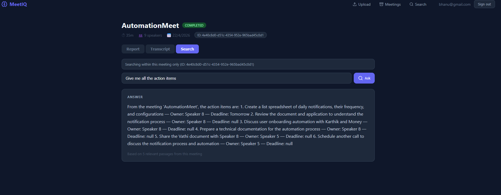
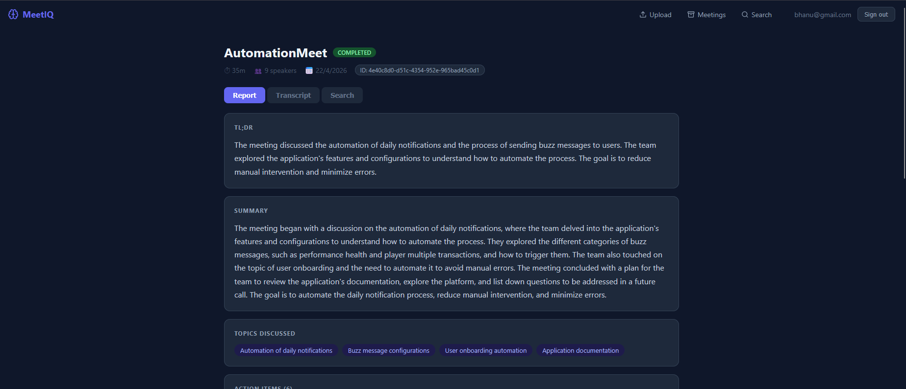
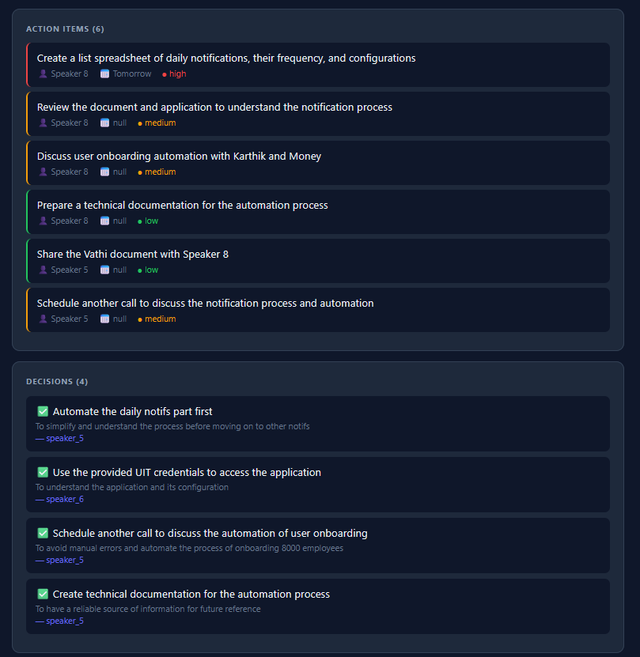

# MeetIQ

## What Is MeetIQ?

Most meeting notes are either forgotten or buried in someone's inbox.
MeetIQ fixes that — upload any meeting recording or transcript and get
a structured AI report with decisions, action items, blockers, and a
searchable archive of everything ever discussed.

Built end-to-end as a solo project: FastAPI backend, multi-agent
LangGraph pipeline, FAISS-powered RAG search, and a React frontend.

---

> **Live Demo:** Coming soon

---
**Upload Image :**






MeetIQ is a full-stack meeting intelligence platform for uploading meetings, transcribing conversations, generating AI reports, and searching insights with retrieval-augmented generation (RAG).

It includes:

- FastAPI backend with MongoDB, Whisper, pyannote, LangGraph, Groq, and FAISS
- React frontend (Vite) with auth, archive, meeting detail, and search pages

## Core Capabilities

- User authentication with JWT (register, login, protected routes)
- Audio/video upload (MP3/WAV/MP4/M4A) with background transcription
- Transcript file upload (TXT/PDF) with immediate parsing
- Speaker diarization and speaker rename support
- AI analysis pipeline with 4 agents:
	- Summary
	- Action items
	- Decisions
	- Blockers
- Semantic search:
	- Global search across meetings
	- Meeting-scoped search
- FAISS vector index persistence for retrieval

## Pipeline Performance

| Stage | Tool | Notes |
|---|---|---|
| Transcription | OpenAI Whisper (local) | Time varies by audio length & hardware |
| Diarization | pyannote.audio (local) | Requires HuggingFace token |
| Analysis | LangGraph + Groq LLaMA 3.3 70B | 4 agents, ~15s total |
| Search | FAISS + Sentence Transformers | Sub-second retrieval |

## Accuracy & Upgrade Path

Current setup uses Whisper (local) for transcription and pyannote.audio for speaker diarization.
Accuracy can be improved by:

- Upgrading from `whisper base` to `whisper large-v3` for 10-15% better WER on noisy audio
- Upgrading pyannote to version 3.1 with GPU support for better speaker
  separation in overlapping speech scenarios
- Using `text-embedding-3-large` instead of `all-MiniLM-L6-v2` for richer
  semantic search

These were deliberate tradeoffs to keep the stack lightweight and
runnable on standard CPU hardware without sacrificing core functionality.

## Architecture Overview

1. User uploads audio/video or transcript.
2. Backend stores upload and creates a meeting document in MongoDB.
3. Audio/video is transcribed with Whisper and diarized with pyannote.
4. User triggers analysis for completed meetings.
5. LangGraph executes summary/action/decision/blocker agents.
6. Final report is saved in MongoDB.
7. Transcript plus report are embedded into FAISS.
8. Search retrieves relevant chunks and Groq generates grounded answers.

## Why Not Render or Railway?

The full local stack (Whisper + pyannote) requires ~1.6GB RAM:

```
Whisper base model      → ~500MB
pyannote diarization    → ~1000MB
FastAPI + dependencies  → ~100MB
─────────────────────────────────
Total                   → ~1.6GB
```

Render free tier is capped at 512MB — the server gets OOM killed on the
first transcription request. Railway's free tier has the same problem.

**Solution:** Replaced local models with API calls (OpenAI Whisper API +
AssemblyAI) so the server stays under 400MB and deploys cleanly on
Google Cloud Run's free tier with 2GB RAM allocated per container.

This was a real infrastructure decision, not a workaround.

## Tech Stack

### Backend

- FastAPI, Uvicorn
- MongoDB (motor/pymongo)
- Whisper (openai-whisper)
- pyannote.audio (speaker diarization)
- LangGraph + LangChain + Groq
- SentenceTransformers + FAISS
- MoviePy (MP4 audio extraction)

### Frontend

- React
- Vite
- React Router
- Axios
- React Hot Toast
- Lucide React

## Repository Structure

```text
Meeting_Patner/
|-- .env
|-- .gitignore
|-- README.md
|-- config.py
|-- main.py
|-- requirements.txt
|-- test.py
|-- backend/
|   |-- databases/
|   |   |-- __init__.py
|   |   `-- mongo.py
|   |-- dependencies/
|   |   |-- __init__.py
|   |   `-- auth.py
|   |-- faiss_store/
|   |-- models/
|   |   |-- __init__.py
|   |   |-- meeting.py
|   |   |-- report.py
|   |   `-- user.py
|   |-- routers/
|   |   |-- __init__.py
|   |   |-- analysis.py
|   |   |-- auth.py
|   |   |-- meetings.py
|   |   |-- search.py
|   |   `-- transcription.py
|   |-- services/
|   |   |-- __init__.py
|   |   |-- agents/
|   |   |   |-- __init__.py
|   |   |   |-- action_item_agent.py
|   |   |   |-- blocker_agent.py
|   |   |   |-- decision_agent.py
|   |   |   `-- summary_agent.py
|   |   |-- auth_service.py
|   |   |-- file_service.py
|   |   |-- graph/
|   |   |   |-- __init__.py
|   |   |   |-- pipeline.py
|   |   |   `-- state.py
|   |   |-- rag/
|   |   |   |-- __init__.py
|   |   |   |-- embeddings.py
|   |   |   `-- search.py
|   |   |-- speaker_service.py
|   |   `-- whisper_service.py
|   `-- utils/
|       |-- __init__.py
|       `-- helpers.py
|-- faiss_store/
|   |-- meetings.index
|   `-- metadata.json
|-- frontend/
|   |-- .gitignore
|   |-- README.md
|   |-- eslint.config.js
|   |-- index.html
|   |-- package-lock.json
|   |-- package.json
|   |-- public/
|   |-- src/
|   |   |-- App.css
|   |   |-- App.jsx
|   |   |-- api/
|   |   |   `-- client.js
|   |   |-- assets/
|   |   |-- auth/
|   |   |   |-- AuthContext.jsx
|   |   |   `-- ProtectedRoute.jsx
|   |   |-- components/
|   |   |   |-- Navbar.jsx
|   |   |   `-- StatusBadge.jsx
|   |   |-- index.css
|   |   |-- main.jsx
|   |   `-- pages/
|   |       |-- Archive.jsx
|   |       |-- Login.jsx
|   |       |-- MeetingDetail.jsx
|   |       |-- NotFound.jsx
|   |       |-- Register.jsx
|   |       |-- Search.jsx
|   |       `-- Upload.jsx
|   `-- vite.config.js
|-- myvenv/
`-- uploads/
```

## Prerequisites

- Python 3.10+
- Node.js 18+
- MongoDB instance (local or Atlas)

## Environment Variables

Create a `.env` file in the project root:

```env
MONGO_URL=mongodb://localhost:27017
DATABASE_NAME=Meeting_Partner
HUGGINGFACE_TOKEN=your_hf_token
GROQ_API_KEY=your_groq_api_key
UPLOAD_DIR=uploads
MAX_FILE_SIZE_MB=200
JWT_SECRET=replace_with_a_strong_secret
JWT_ALGORITHM=HS256
JWT_EXPIRE_MINUTES=4320
```

### Env Notes

- `HUGGINGFACE_TOKEN` is required for pyannote diarization.
- `GROQ_API_KEY` is required for analysis and RAG answers.
- `JWT_SECRET` must be set in non-dev environments.
- Upload files are stored in `UPLOAD_DIR`.

## Local Setup

### 1) Backend Setup

```bash
python -m venv myvenv
myvenv\Scripts\activate
pip install -r requirements.txt
uvicorn main:app --reload --port 8000
```

Backend endpoints:

- API root: `http://127.0.0.1:8000/`
- Swagger docs: `http://127.0.0.1:8000/docs`
- Health: `http://127.0.0.1:8000/health`

### 2) Frontend Setup

```bash
cd frontend
npm install
npm run dev
```

Frontend URL:

- `http://localhost:5173`

Vite proxies `/api/*` requests to `http://localhost:8000`.

## Authentication Flow

1. Register or login from frontend.
2. Backend returns `access_token` and `user`.
3. Frontend stores token in `localStorage`.
4. Axios attaches `Authorization: Bearer <token>` for protected endpoints.
5. On `401`, frontend clears auth data and redirects to `/login`.

## Frontend Routes

- `/login` Public login page
- `/register` Public register page
- `/` Protected upload page
- `/archive` Protected meeting archive
- `/meetings/:id` Protected meeting details (report/transcript/search tabs)
- `/search` Protected global or meeting-specific search page
- `*` Not found page

## Backend API

All endpoints below are protected by JWT unless marked Public.

### Public

- `GET /` API status message
- `GET /health` Health check
- `POST /auth/register`
- `POST /auth/login`

### Auth

- `POST /auth/register`
	- Body (JSON):
		```json
		{
			"email": "user@example.com",
			"password": "your-password",
			"full_name": "Optional Name"
		}
		```
- `POST /auth/login`
	- Body (JSON):
		```json
		{
			"email": "user@example.com",
			"password": "your-password"
		}
		```
- `GET /auth/me`

### Transcription

- `POST /transcription/upload-audio`
	- Multipart fields: `file`, `title`
	- Allowed types: `audio/mpeg`, `audio/mp3`, `audio/wav`, `audio/x-wav`, `audio/mp4`, `video/mp4`, `audio/m4a`
	- Creates meeting + starts background transcription
- `POST /transcription/upload-transcript`
	- Multipart fields: `file`, `title`
	- Allowed types: `text/plain`, `application/pdf`
	- Parses transcript immediately
- `GET /transcription/status/{meeting_id}`

### Meetings

- `GET /meetings/` List current user's meetings
- `GET /meetings/{meeting_id}` Full meeting details
- `PATCH /meetings/{meeting_id}/rename-speaker`
	- Query params: `speaker_id`, `new_name`
- `DELETE /meetings/{meeting_id}`

### Analysis

- `POST /analysis/{meeting_id}/analyze`
	- Requires meeting `status = completed`
	- Starts background analysis pipeline
- `GET /analysis/{meeting_id}/report`
	- Returns one of:
		- `analyzing`
		- `failed`
		- `completed` with `report`

### Search

- `POST /search/`
	- Body:
		```json
		{
			"query": "What decisions were made?",
			"meeting_id": null
		}
		```
- `GET /search/meetings/{meeting_id}/search?q=...`

## End-to-End Runtime Flow

1. User uploads file from Upload page.
2. Backend writes uploaded file to disk and meeting metadata to MongoDB.
3. For audio/video:
	 - Optional MP4 -> WAV extraction via MoviePy
	 - Whisper transcription (timestamps)
	 - pyannote diarization
	 - Speaker extraction + segment merge
4. User opens meeting detail and triggers analysis.
5. LangGraph runs 4 agents sequentially:
	 - `summary_agent`
	 - `action_item_agent`
	 - `decision_agent`
	 - `blocker_agent`
6. `report_builder` composes final report and stores in MongoDB.
7. Transcript + report are chunked and embedded into FAISS.
8. Search endpoint retrieves chunks and Groq answers using retrieved context.

## Data Persistence

- MongoDB collections:
	- `users`
	- `meetings`
- Upload files:
	- `uploads/` by default (`UPLOAD_DIR`)
- Vector index:
	- Code path currently points to `backend/faiss_store/meetings.index` and `backend/faiss_store/metadata.json`
	- There is also a root-level `faiss_store/` folder in this repository

## Useful Commands

### Backend

```bash
uvicorn main:app --reload --port 8000
```

### Frontend

```bash
cd frontend
npm run dev
npm run build
npm run preview
npm run lint
```

## API Example Calls

### Register

```bash
curl -X POST "http://127.0.0.1:8000/auth/register" \
	-H "Content-Type: application/json" \
	-d "{\"email\":\"user@example.com\",\"password\":\"password123\",\"full_name\":\"Demo User\"}"
```

### Login

```bash
curl -X POST "http://127.0.0.1:8000/auth/login" \
	-H "Content-Type: application/json" \
	-d "{\"email\":\"user@example.com\",\"password\":\"password123\"}"
```

### Upload Audio (Protected)

```bash
curl -X POST "http://127.0.0.1:8000/transcription/upload-audio" \
	-H "Authorization: Bearer <JWT_TOKEN>" \
	-F "title=My Meeting" \
	-F "file=@sample.wav"
```

### Trigger Analysis (Protected)

```bash
curl -X POST "http://127.0.0.1:8000/analysis/<meeting_id>/analyze" \
	-H "Authorization: Bearer <JWT_TOKEN>"
```

### Search Within Meeting (Protected)

```bash
curl "http://127.0.0.1:8000/search/meetings/<meeting_id>/search?q=What decisions were made" \
	-H "Authorization: Bearer <JWT_TOKEN>"
```

## Troubleshooting

### `422 Unprocessable Entity` on `/auth/login`

- Usually request body format mismatch.
- Login expects JSON with `email` and `password`.

### `401 Unauthorized`

- JWT missing, expired, or invalid.
- Frontend auto-clears token and redirects to `/login` on 401.

### Meeting title saved as `Untitled Meeting`

- Upload endpoints must read `title` from multipart form.
- Current code uses `Form(default="Untitled Meeting")` for both upload endpoints.

### Search returns no relevant data

- Analysis must be completed first for the meeting.
- Report and embeddings must exist.

### Diarization fails

- Verify `HUGGINGFACE_TOKEN` is valid and has access to pyannote models.

### Analysis or RAG fails

- Verify `GROQ_API_KEY` is set.

### MP4 upload issues

- Ensure the MP4 contains an audio track.

### Password verification error for very long passwords

- Bcrypt accepts up to 72 bytes input.

### Frontend upload size mismatch

- Backend max upload size is `MAX_FILE_SIZE_MB` (default 200 MB).
- Frontend currently blocks files over 100 MB but shows an error text saying 50 MB.

## Development Notes

- Models are loaded lazily and cached in process (Whisper, pyannote, embeddings, Groq clients).
- First transcription/diarization can be slower due to model load.
- Analysis and transcription are background tasks; frontend polls status.
- CORS allows `http://localhost:3000` and `http://localhost:5173`.
- `test.py` is a standalone helper script and is not part of runtime API.

## Security Notes

- Do not commit real API keys or Hugging Face tokens.
- Use strong `JWT_SECRET` in production.
- Rotate credentials if a token was exposed.

## What I'd Build Next

- [ ] Email follow-up generator — draft per-attendee emails from action items
- [ ] Slack/Teams integration — post reports automatically after meetings
- [ ] Real-time transcription — live meeting support via WebSocket
- [ ] Multi-language support — Whisper supports 99 languages, pipeline is language-agnostic
- [ ] Mobile app — React Native with audio recording built in
